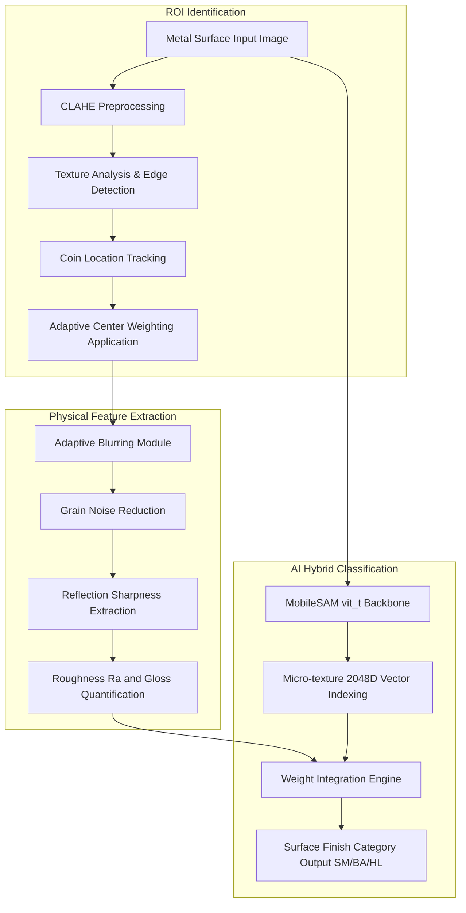

# V-SAMS (Surface Analysis & Measurement System)


## 1. 개요
산업용 스테인리스강의 표면 마감 상태를 동전 반사 원리 및 이미지 특징 공간 분석을 결합하여 분류 및 정량 분석하는 측정 엔진입니다. 향후 SG_proj_004 종합 플랫폼의 서브 엔진으로 병합될 예정입니다.

## 2. 아키텍처 다이어그램


## 3. 기술 스택
- Language: Python 3.10+
- Backend/AI Engine: PyTorch, MobileSAM (vit_t), OpenCV
- Frontend/UI: Streamlit, FastAPI
- Verification/Linting: Ruff, Mypy, Black, Isort, Pytest

## 4. 데이터셋 출처
- 분류 평가를 위해 수집된 내부 스테인리스강 표면 마감 데이터 활용.

## 5. 주요 기능
- 전처리 및 질감 분석 알고리즘을 통한 기준 물체(동전) 자동 탐지.
- 가변 블러링 기술을 활용한 표면 노이즈 제거 및 반사상 선명도 추출.
- 조도 및 광택도 수치를 통한 표면 마감 상태 분류.
- 시각 특징 벡터(MobileSAM)와 물리 기반 추정값을 혼합한 판정 기능.

## 6. 설치 및 실행 방법
1. 설치
   ```bash
   pip install -e .[dev]
   pre-commit install
   ```
2. 웹 인터페이스 실행
   ```bash
   streamlit run app.py
   ```
3. API 엔드포인트 실행
   ```bash
   uvicorn api:app --host 0.0.0.0 --port 8000 --reload
   ```


---
*Updated by System: 2026-06-29 (Resolved 260627 Analysis Report priority issues)*
## 최신 업데이트 내역
## 최신 업데이트 내역 (2026-07-05)
- [CI/CD]: 통합 E2E 테스트 검사 통과 및 전체 모듈 연동 보고서 발간 완료.
- [CI/CD]: 통합 E2E 테스트 검사 통과 및 전체 모듈 연동 보고서 발간 완료.
- [CI/CD]: 통합 E2E 테스트 검사 통과 및 전체 모듈 연동 보고서 발간 완료. (2026-06-29)
- 기존의 하드코딩된 더미 예측 점수를 완전히 폐기하고, SurfaceEvaluator 객체를 통한 실제 비전 분석 로직으로 연동 완료.

## 2026-07-05 업데이트
- GPU 가속 컨테이너화 (nvidia/cuda:12.1.1-runtime-ubuntu22.04 기반) 완료.
