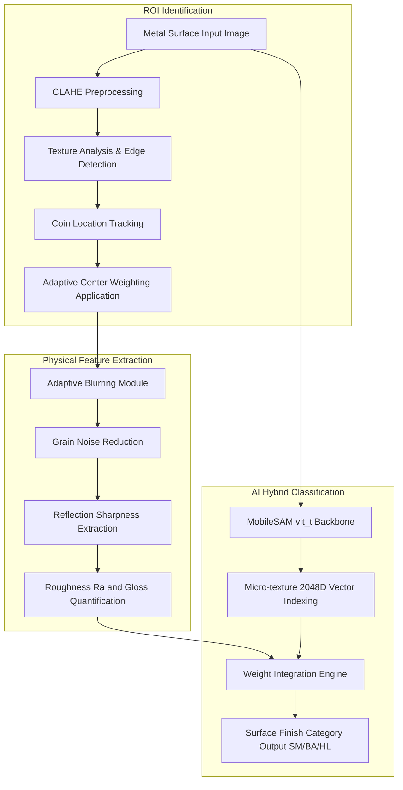

# V-SAMS (Surface Analysis & Measurement System)


## 1. 개요
산업용 스테인리스강의 표면 마감 상태를 동전 반사 원리 및 이미지 특징 공간 분석을 결합하여 분류 및 정량 분석하는 측정 엔진입니다. 향후 SG_proj_004 종합 플랫폼의 서브 엔진으로 병합될 예정입니다.

## 2. 아키텍처 다이어그램


## 3. 기술 스택
- Language: Python 3.10+
- Backend/AI Engine: PyTorch, MobileSAM (vit_t), OpenCV
- Frontend/UI: Streamlit, FastAPI
- Verification/Linting: Ruff, Mypy, Black, Isort, Pytest

## 4. 데이터셋 출처
- 분류 평가를 위해 수집된 내부 스테인리스강 표면 마감 데이터 활용.

## 5. 주요 기능
- 전처리 및 질감 분석 알고리즘을 통한 기준 물체(동전) 자동 탐지.
- 가변 블러링 기술을 활용한 표면 노이즈 제거 및 반사상 선명도 추출.
- 조도 및 광택도 수치를 통한 표면 마감 상태 분류.
- 시각 특징 벡터(MobileSAM)와 물리 기반 추정값을 혼합한 판정 기능.

## 6. 설치 및 실행 방법 (Dual Environment)

이 프로젝트는 시연용 **개별 로컬 구동(Mac)**과 테스트/개발용 **MSA 통합 구동(Windows)**을 모두 지원합니다.

### [Option A] Mac 로컬 구동 (프리젠테이션 및 개별 테스트용)
기존 방식대로 가상환경을 활성화하고 개별적으로 구동합니다.
1. 환경 설정
   ```bash
   python -m venv .venv
   source .venv/bin/activate
   pip install -r requirements.txt
   ```
2. 시뮬레이터 실행
   ```bash
   streamlit run app.py
   ```

### [Option B] Windows 워크스테이션 구동 (통합 테스트 및 딥러닝 연산용)
메인 데스크탑(RTX 5080)에서는 `SG_sys`의 도커 컴포즈를 통해 전체 MSA 시스템을 한 번에 구동합니다.
```powershell
# SG_sys 디렉토리에서 실행
docker-compose -f docker-compose-windows.yml up -d --build
```

---
*Last Updated: 2026-07-19 (Hybrid Environment & MSA Integration)*
