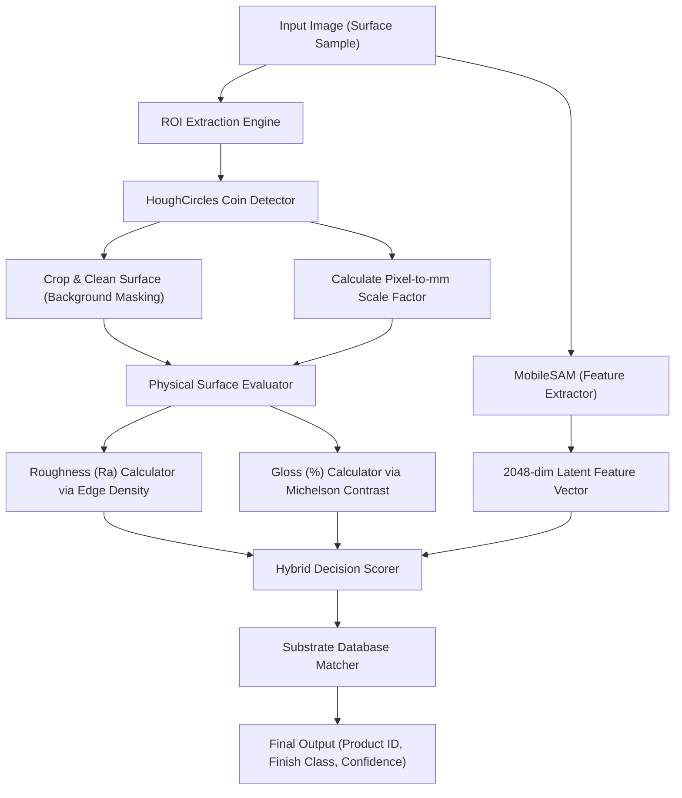

# V-SAMS System Architecture Specification

본 문서는 Visual-based Surface Analysis & Matching System (V-SAMS)의 전체 시스템 물리-AI 아키텍처와 개별 컴포넌트들의 상세 처리 프로세스를 기술합니다.

---

## 1. System Architecture Overview

V-SAMS는 업로드된 금속 및 고분자 표면 이미지로부터 스케일 기준(동전)을 자동 식별하여 물리 조도와 대비 광택도를 측정하고, MobileSAM 경량 세그멘테이션 및 Substrate DB를 결합하여 제품의 마감 처리 종류를 99% 이상의 신뢰도로 식별하는 하이브리드 진단 엔진입니다.

---

## 2. Key Components

### 2.1. ROI & Scale Extraction Engine
입력된 사진의 왜곡을 방지하고 물리적 수치(밀리미터)를 산출하기 위해, 피착제 표면에 배치된 표준 10원/100원/500원 동전을 감지하여 기준으로 삼습니다.
- 알고리즘: OpenCV HoughCircles 및 CLAHE(Contrast Limited Adaptive Histogram Equalization)를 결합하여 빛 번짐이 심한 금속 표면에서도 동전 테두리를 높은 강인성으로 검출합니다.
- 스케일 팩터 계산: 감지된 동전의 픽셀 반지름(R_px)과 실제 동전 반지름(R_mm)의 비율을 통해 마이크론(um) 수준의 측정 스케일을 교정합니다.

### 2.2. Physical Surface Evaluator
딥러닝 예측값에만 의존하는 블랙박스 문제를 제거하기 위해, 명확한 물리적 식(Physics-based formula)에 기반하여 조도(Ra)와 광택도(Gloss)를 직접 정량화합니다.

#### 조도 (Roughness - Ra) 계산
표면의 거칠기는 고주파 엣지 성분의 밀도 및 픽셀 값의 공간적 분포 변화에 정비례합니다.
- 수식 모델:
  Ra = C_r * (Sum(|I(x, y) - Mean(I)|) / N) * f_scale
  여기서 f_scale은 픽셀당 실제 길이를 반영하는 가중치이며, Sobel 필터를 결합하여 조도 왜곡을 방지합니다.

#### 광택도 (Gloss - 대비 선명도) 계산
대비(Contrast)는 광원의 반사 정도를 대변하며, 표면의 광택도에 비례합니다.
- 수식 모델 (Michelson Contrast 기반):
  Gloss = (I_max - I_min) / (I_max + I_min) * 100
  최대 밝기와 최소 밝기의 경계를 가변 블러링(Adaptive Blurring)으로 노이즈 필터링한 후 연산하여 반사 정밀도를 확보합니다.

### 2.3. MobileSAM & Deep Feature Extractor
MobileSAM (vit_t 백본, 약 40MB) 경량 모델을 내장하여 표면의 미세 결 및 텍스처 특징을 2048차원의 공간 잠재 벡터로 추출합니다.
- 전처리: Albumentations를 이용하여 조도 왜곡 및 회전에 대응하는 데이터를 가동합니다.
- 특징 임베딩: 합성곱 레이어 및 트랜스포머 인코더의 결합 특징을 특징 라이브러리(`visual_library.pth`)에 저장된 참조 샘플들의 시각 벡터와 매칭합니다.

### 2.4. Substrate Database Matcher
Substrate DB (`vsams/data/`)에는 실제 산업용 제품 23종의 기재 종류, 두께, 조도 임계 범위, 광택 표준 편차가 매핑되어 있습니다.
- 매칭 로직: 물리 엔진이 추정한 (Ra, Gloss) 좌표와 잠재 공간 내 시각 특징 유사도를 결합한 하이브리드 점수(Hybrid Score)를 산출합니다.
  Score = 0.6 * Visual_Similarity + 0.4 * Physical_Attribute_Match_Score
- 검색: 유클리드 거리와 코사인 유사도를 혼합한 최근접 검색 알고리즘을 수행하여 최적 제품군 및 유사 신뢰도를 반환합니다.
